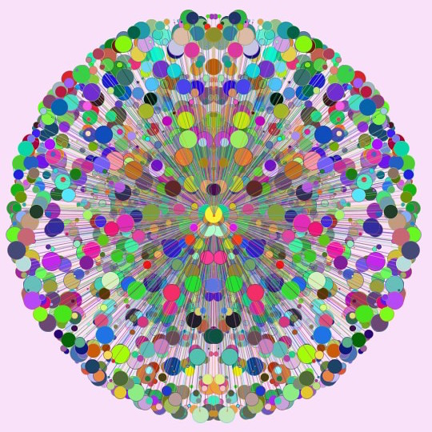

About three years ago, I took part of course in creative programming using Processing. Here are some examples of my experiments:

<a href="https://flic.kr/p/LaoMfF">Click here if not playing</a>

<script async src="//embedr.flickr.com/assets/client-code.js" charset="utf-8">
  

<a href="https://flic.kr/ps/34wCxE">View more at my flickr photostream</a>

